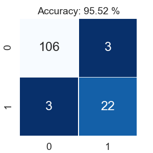

# canb-ML
Supervised classification of neonatal data

---
Given high-dimensional dataset with live births as labels, build supervised machine learning model to predict classes in unseen dataset.
* __preprocess__ data into a form amenable to supervised ML algorithms ([`data_preprocessing.ipynb`](data_preprocessing.ipynb))
* evaluate information and __select features__ or __impute missing data__ to best inform classifier ([`imputation.ipynb`](imputation.ipynb))
* benchmark classifiers on training set using cross-validation to determine best algorithm for future predictions ([`cross_val.ipynb`](cross_val.ipynb))
---
Before starting, set up Python environment:
```
pip install -r requirements.text
```
---
Final imputation and training of algorithms described in [`training_presentation.ipynb`](training_presentation.ipynb), and implemented as command-line scripts [`vlbw_pipeline.py`](vlbw_pipeline.py), [`vlbw_test_pipeline.py`](vlbw_test_pipeline.py), and [`training_pipeline.py`](training_pipeline.py).  

Example workflow as follows:
```
# preprocess and impute training data and save as new file
python vlbw_pipeline.py data/vlbw_train.csv -o data/vlbw_train_imputed.csv

# preprocess and impute testing data and save as new file
python vlbw_test_pipeline.py data/vlbw_test.csv -o data/vlbw_test_imputed.csv

# train Random Forest Classifier with optimal parameters on filtered and imputed training data,
# predict labels on filtered and imputed testing data, and print out resulting metrics
python training_pipeline.py data/vlbw_train_imputed.csv data/vlbw_test_imputed.csv -o data/vlbw_test_predicted.csv
```

Final performance on testing dataset:  

